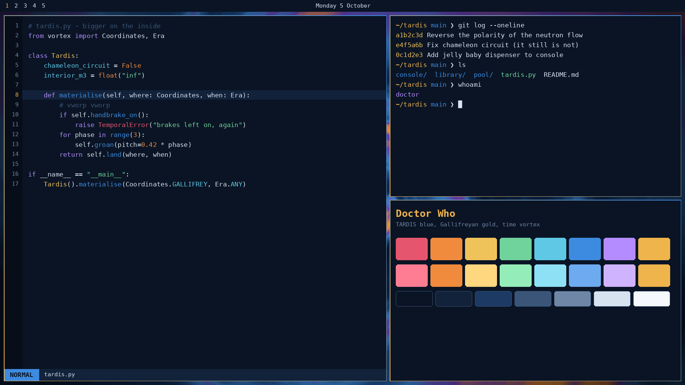

# Doctor Who for Omarchy

A dark Omarchy theme in TARDIS blue with Gallifreyan gold accents and a few
time-vortex colours. Window borders fade from gold into TARDIS blue.



Built for **Omarchy 4** (the `colors.toml` theme format). Omarchy renders every
app config from `colors.toml`, so this one file themes Hyprland borders, the
Omarchy shell (bar, launcher, menus, notifications, OSD, lock screen),
Alacritty, Kitty, Ghostty, Foot, btop, Neovim, Helix, Chromium, VS Code,
Obsidian, gum prompts and keyboard RGB.

## What's inside

| File | What it does |
| --- | --- |
| `colors.toml` | The palette, plus the gold-to-blue window border gradient |
| `backgrounds/` | Four original wallpapers (3840x2160), pick one with Super+Ctrl+Space |
| `icons.theme` | Yaru-blue icon set |
| `unlock.png` | Default logo for the unlock screen (the seal) |
| `unlock-logos/` | All the unlock screen logos to choose from |
| `doctor-who-unlock` | Picks the unlock screen logo, or a random one |
| `preview.png` | Picture shown in the theme picker |
| `extras/` | Fastfetch and Spotify (Spicetify) themes, plus the art scripts |

Wallpapers, all drawn procedurally for this theme:

1. **Time Vortex** – a swirling blue, violet and orange tunnel
2. **Roundels** – console-room wall roundels with gold rims
3. **Circular Script** – Gallifreyan-inspired circle writing over stars
4. **Blue Box Adrift** – a little blue box tumbling through a nebula

## Palette

| Role | Colour | |
| --- | --- | --- |
| background | `#0a1424` | deep space navy |
| foreground | `#d8e3f0` | police-box sign white |
| accent | `#f0b44c` | Gallifreyan gold |
| blue | `#3d8be0` | TARDIS blue (lifted for contrast) |
| cyan | `#5ec8e5` | sonic blue |
| green | `#6fd39b` | sonic green |
| orange | `#f08a3c` | vortex orange |
| magenta | `#b48cff` | vortex violet |
| red | `#e5566e` | Dalek red |
| yellow | `#f0c35a` | lamp yellow |

## Install

### Copy it in (simplest)

Put the `doctor-who-theme` folder (or `doctor-who-theme.tar.gz`) on your Omarchy machine, then:

```bash
tar xzf doctor-who-theme.tar.gz            # only if you grabbed the tarball
mkdir -p ~/.config/omarchy/themes
cp -r doctor-who-theme ~/.config/omarchy/themes/doctor-who
omarchy-theme-set doctor-who
```

Or open the theme menu with Super+Shift+Ctrl+Space and pick **Doctor Who**.

### From a git repo

Straight from GitHub:

```bash
omarchy-theme-install https://github.com/martijnhe/omarchy-doctor-who-theme
```

Omarchy strips the `omarchy-` prefix and `-theme` suffix, so it installs as
`doctor-who` and switches to it straight away.

## Unlock screen logo

Omarchy's unlock screen is the one where you type your password at boot
(and the SDDM login screen, if you use SDDM). This theme lets you choose which
logo it shows:

```bash
cd ~/.config/omarchy/themes/doctor-who
bash doctor-who-unlock            # picker with a preview of every logo, plus Random
bash doctor-who-unlock random     # pick one at random
bash doctor-who-unlock seal       # pick one by name
bash doctor-who-unlock list       # show the names
```

It asks for sudo and rebuilds the boot image, so give it a moment. The new
logo shows up the next time you boot.

### Using your own logos

Drop PNG, JPG or WebP files into:

```
~/.config/omarchy/doctor-who/unlock-logos/
```

The file name becomes the logo's name (`tenth-doctor.png` → `tenth-doctor`).
A transparent PNG looks best. Anything bigger than 800x400 is shrunk to fit.
Your folder survives reinstalling the theme, and a logo there with the same
name as a built-in one replaces it.

The built-in logos (`seal`, `blue-box`, `vortex`, `wordmark`, `sonic`,
`omarchy`) live in the theme's `unlock-logos/` folder; delete any you don't want.

"Random" picks one when you run it. It doesn't change by itself on every
boot, because the logo is baked into the boot image and changing it needs sudo.

## Extras: fastfetch and Spotify

Two matching themes for apps Omarchy doesn't theme itself. Install both with:

```bash
bash ~/.config/omarchy/themes/doctor-who/extras/install-extras.sh
```

or just one with `install-extras.sh fastfetch` / `install-extras.sh spicetify`.

**Fastfetch** gets a police-box logo with a glowing lamp and the system info
renamed for the console room: Planet (OS), Time Rotor (kernel), Artron Core
(CPU), Chameleon Circuit (GPU), Bigger on Inside (memory), Zero Room (disk) and
a random Doctor quote. Your old config is saved as `config.jsonc.bak`; put it
back with:

```bash
mv ~/.config/fastfetch/config.jsonc.bak ~/.config/fastfetch/config.jsonc
```

**Spotify** (needs [Spicetify](https://spicetify.app)) gets a starfield, a
slowly drifting time vortex, console-room roundels with a Gallifreyan seal in
the sidebar, a play button that pulses like the TARDIS lamp, vortex-coloured
progress bars and a regeneration glow on hovered cards. If Spicetify can't
patch Spotify, give it write access first:

```bash
sudo chmod a+wr /opt/spotify /opt/spotify/Apps -R
spicetify config spotify_path /opt/spotify
spicetify backup apply
```

After a Spotify update, run `spicetify backup apply` again. To go back to
plain Spotify: `spicetify restore`.

## Uninstall

```bash
omarchy-theme-set tokyo-night              # or any other theme
rm -rf ~/.config/omarchy/themes/doctor-who
```

## Credits

Unofficial fan theme. Doctor Who and TARDIS are trademarks of the BBC; this
theme is not affiliated with or endorsed by the BBC. All artwork here was
generated from scratch with the scripts in `extras/`. The
`omarchy` unlock logo is Omarchy's own wordmark, recoloured.
